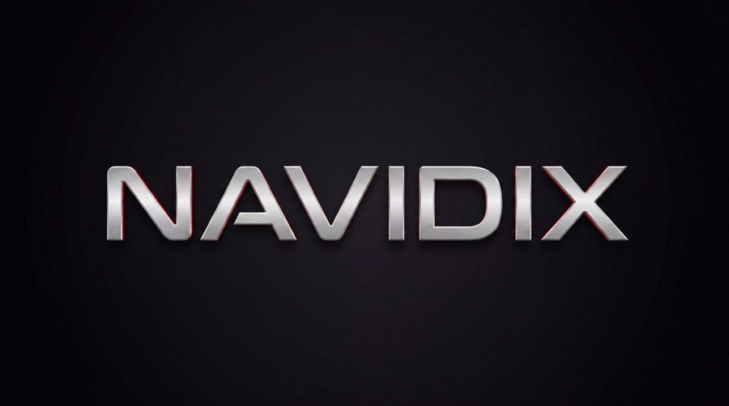
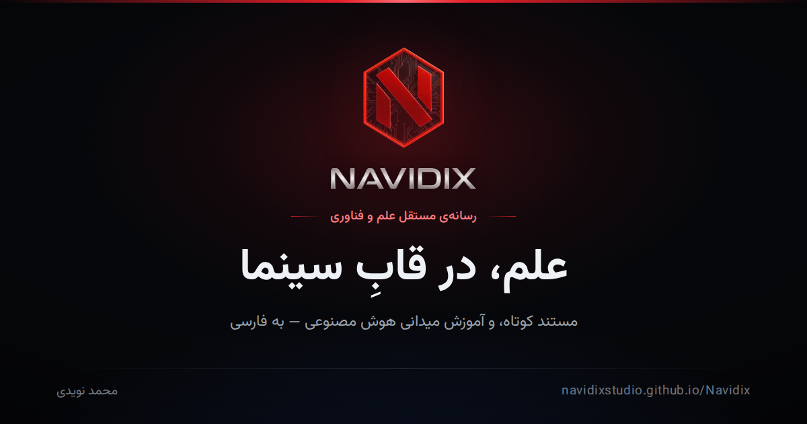

<p align="center">
  
</p>

<p align="center">
  <b>نویدیکس — رسانه‌ی مستقل علم و فناوری</b><br>
  <sub>Independent science &amp; technology media, built from scratch: cinematic short docs + hands-on AI training, in Persian.</sub>
</p>

<p align="center">
  <a href="https://navidixstudio.com"></a>
  
  
  
</p>

<p align="center">
  
</p>

## What this is

**Navidix** (نویدیکس) is an independent media studio sitting at the intersection of
science, cinema, and AI. It publishes short cinematic documentaries about
science, technology, history, and space, alongside a practical, field-tested
curriculum for AI-assisted content production — all in Persian, built and
run by one person: **Mohammad Navidi**.

This repo is the entire product: the public site, the training platform, a
custom admin CMS, and the tooling that generates most of it. No framework,
no build step for the frontend — just HTML/CSS/JS shipped straight to
GitHub Pages, and a Supabase backend behind it.

**→ [navidixstudio.com](https://navidixstudio.com)**

## Highlights

- **A real CMS, written from zero.** `admin.html` + `nvx-admin-*.js` is a
  full editorial back office — content, media, users/roles, workflows,
  analytics, audit log — talking to Supabase with row-level security doing
  the actual access control (`supabase/schema.sql`, `cms-rbac.sql`).
- **An AI co-editor inside the admin panel**, not bolted on the side:
  `nvx-admin-ai.js` + a Supabase edge function (`supabase/functions/ai-assistant`)
  assist with drafting and structuring content in-place.
- **A training curriculum, not a blog.** `training.html` and the `ai-*.html`
  lessons walk through an actual AI-video production pipeline: prompting,
  image/sound, camera language, light & composition, rights & contracts,
  monetization — written from what worked in real production, with numbers.
- **A 200-style prompt library generated from one file.** `tools/styles.py`
  is the single source of truth; `build-library.py` derives every style page,
  index card, search tag, and sitemap entry from it. Adding style #201 costs
  nothing extra — see `tools/README.md` for the full generator design.
- **Interactive science explainers**, not static articles: `explore/` has
  hand-built Three.js/GSAP simulations (atoms & molecules, evolution of life,
  space-time, neural networks, human→machine) instead of stock diagrams.
- **CI with a human in the loop, on purpose.** GitHub Actions curate YouTube
  resources for lessons via Gemini, but publishing always goes through a
  Pull Request a human merges — nothing AI-suggested lands on `main`
  unreviewed (`.github/workflows/curate-resources.yml`).

## Under the hood

| Layer | Choice |
|---|---|
| Frontend | Vanilla HTML/CSS/JS — no framework, no bundler |
| 3D / motion | Three.js, GSAP |
| Backend | Supabase (Postgres + RLS, Auth, Edge Functions) |
| Content generation | Python (`tools/*.py`) + Node (`tools/*.mjs`, Playwright for image plates) |
| Hosting | GitHub Pages, custom domain (`CNAME` → navidixstudio.com) |
| Automation | GitHub Actions, human-approved via PR |

## Repository layout

```
├── index.html, about.html, training.html, prompts.html …   the site
├── admin.html + nvx-admin-*.js                              editorial CMS
├── nvx-auth.js, nvx-content.js, nvx-config.js                shared app layer
├── explore/                                                  interactive science simulations
├── lessons/, content/articles/                                curriculum & article assets
├── style/, prompts/                                           the generated 200-style prompt library
├── supabase/                                                  schema, RLS policies, edge functions
├── tools/                                                      Python/Node generators — see tools/README.md
└── .github/workflows/                                          content-curation automation
```

## Engineering notes

`tools/README.md` (in Persian) is worth reading on its own — it documents
real incidents and the guardrails that came out of them:

- Page generators splice HTML by **marker comment, never by line number**,
  after a line-number-based cut once shipped wrong Open Graph cover images
  to 31 pages.
- A daily content-generation workflow ran green for 41 runs while silently
  producing nothing, because a failure path was swallowed into a friendly
  `echo` instead of a non-zero exit. The fix — and the rule it left behind —
  is written up as a warning to the next automation added here: **absence of
  output must fail the job, not get logged and waved through.**

## Running it locally

The frontend is static — no build step:

```bash
python3 -m http.server 8080   # or any static file server
```

Then open `http://localhost:8080`. The admin panel and content that need
Supabase require your own project URL/key in `nvx-config.js` (the
publishable key is meant to be public; access control lives in
`supabase/schema.sql`'s row-level security, not in keeping that key secret).

To regenerate the prompt library or lesson pages, see the commands in
`tools/README.md`.

## Connect

[Website](https://navidixstudio.com) · [YouTube](https://youtube.com/@navidix) · [Instagram](https://www.instagram.com/navidi__ai) · [Telegram](https://t.me/NavidixMedia) · [LinkedIn](https://www.linkedin.com/in/mohammad-navidi-7b8b75381)

---

<p align="center"><sub>Built and run by Mohammad Navidi.</sub></p>
